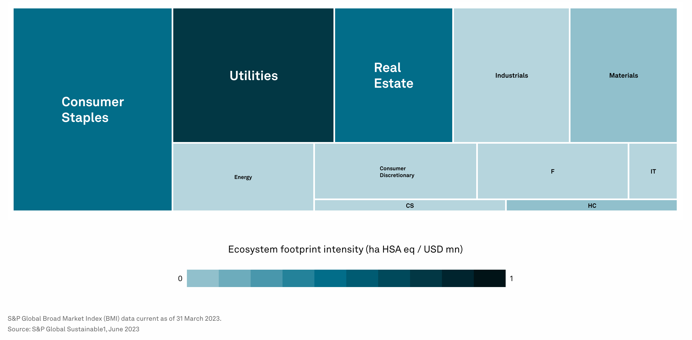

# By Sector & Industry

The following sections delve into the nature-related risks and dependencies across 11 GICS sectors consisting of 157 sub-industries and 150+ economic production processes. As applicable, each sector and industry is cross referenced to SASB and NACE.

Industries are ordered based on the S\&P Ecosystem Footprint, prioritizing sectors by their impact measured in hectares. This metric integrates three critical aspects: the **land area** affected by a company's operations, the **extent of reduction in ecosystem integrity**, and the **importance of the impacted ecosystems**. By amalgamating these factors, it calculates a company's equivalent impact on key global ecosystems in terms of biodiversity conservation and service provision, expressed as the number of hectares of the most significant ecosystems fully degraded.

## GICS Sectors by Ecosystem Footprint

<figure><figcaption>
<a href="https://www.spglobal.com/esg/solutions/nature">source</a>
</figcaption></figure>

## Impact & Dependency Risk

<figure><figcaption>
Compilation of S&#x26;P UNEP Public Data
</figcaption></figure>
